<!-- YoRHa archive -->
<p align="center"></p>

An HTTP/1.1 web server written from scratch in C++98: one non-blocking event loop, virtual hosts, uploads, directory listing and CGI, all driven by an INI config file.

## ▸ Overview
`webserv` listens on several `host:port` pairs at once. Every socket, listening or client, sits in a single `poll()` loop and is set to non-blocking, so no thread is spawned per connection. Requests are parsed incrementally (headers first, then a body bounded by `Content-Length`). They are routed by the `Host` header and the URI prefix, then answered from static files, a generated directory listing, an upload handler or a CGI child process. The loop originally used `kqueue` (macOS) and was later ported to `poll()` so it also builds and runs on Linux.

## ▸ Features
- **Multiple servers** from one config file, each with its own name, host, port, body-size limit and error pages
- **Virtual-host check**: the `Host` header must match the server `name` or its `ip:port`
- **Methods**: `GET`, `POST`, `DELETE`, allowed per route (`405` otherwise)
- **Static files** with MIME types picked from the file extension, plus optional forced download (`Content-Disposition: attachment`)
- **Directory listing** (`listing = TRUE`) and per-route default page
- **Uploads**: `multipart/form-data` POST bodies are written to a per-route `download_dir`
- **Redirects**: `302` to a configured route
- **CGI**: the script runs through an interpreter chosen by extension (Python, PHP, Ruby, Perl, sh, Tcl). Query-string or form arguments are passed as environment variables.
- **Error pages**: custom per server (`[SERVER_n:ERROR]`), with a fallback set in `error_pages/<code>.html`
- **Limits and timeouts**: `413` above `max_body_size`, `411` for a POST without length, idle clients are closed
- **Cookies**: optional session cookie per client (`cookies = TRUE`), stored in `cookies.data`
- **Logs**: split into `log/` (`connections`, `exec`, `read`, `write`, `error`, `loadedConfig`)

## ▸ Usage
```bash
make tg                          # build the binary only
./webserv config/miaou.ini       # demo site "DreamWorld" on 127.0.0.1:8080
./webserv                        # no argument -> config/defaultConfig.ini
```
`make` and `make tg` both build the binary; `make clean`, `make fclean` and `make re` work as usual.

Then browse `http://127.0.0.1:8080/`, or try it with curl:
```bash
curl http://127.0.0.1:8080/img/                               # directory listing
curl "http://127.0.0.1:8080/cgi/addition.py?num1=2&num2=3"    # Python CGI
```

<p align="center"></p>

### Config format
```ini
[SERVER_1]
name = nonnon.com:8080
host = 127.0.0.1
port = 8080
max_body_size = 50M
default_error_page = Web/DreamWorld/test.html
cookies = TRUE

[SERVER_1:ERROR]
404 = Web/DreamWorld/test.html

[SERVER_1:ROUTES:IMAGES]
path = /img/
root = Web/DreamWorld/img/
methods = GET POST
listing = TRUE
download = TRUE
download_dir = Web/DreamWorld/img/

[SERVER_1:ROUTES:CGI]
path = /cgi/
root = Web/DreamWorld/cgi/
methods = GET POST
cgi = .py .php .cgi .pl
```
Other route keys: `default_page`, `upload`, `force_upload`, `redir`, `redir_route`.

## ▸ Structure
```
src/ServRunner.cpp     poll() event loop, accept, timeouts
src/client/            Client (read/write state), Request parsing, RequestHandler (GET/POST/DELETE/CGI), Response
src/config/            INI parser, ServConfig, Route, status codes and error pages
config/                sample configurations
error_pages/           default status pages
Web/                   demo sites (DreamWorld, Server1, Server2) and CGI scripts
```

## ▸ Squad
Built at 42 Lausanne by a team of two: **Cecile** ([cduffaut](https://github.com/cduffaut)) and **Alexandre** ([alde-oli](https://github.com/alde-oli)). This repository is my copy of the final code; the original per-person history was not kept.

## ▸ Notes
- The commit history is a final snapshot pushed after the project ended, so it does not show who wrote which part.
- Not implemented: chunked `Transfer-Encoding`. The CGI output is read synchronously, so a slow script blocks the loop while it runs.
- CGI interpreters are looked up at fixed paths (`/usr/bin/python`, `/usr/bin/php`, …).

---
<sub>▸ Archived by UNIT ALDE-OLI · [profile](https://github.com/alde-oli)</sub>
